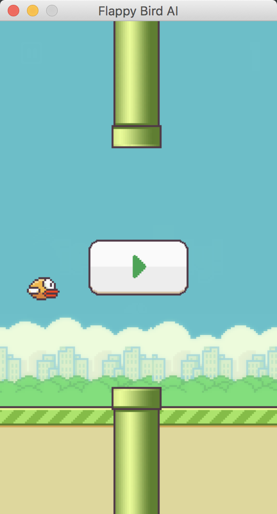
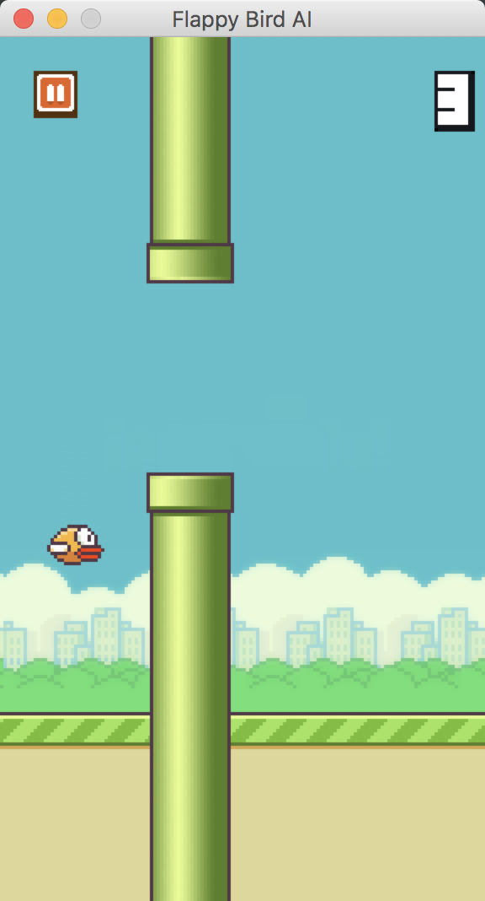
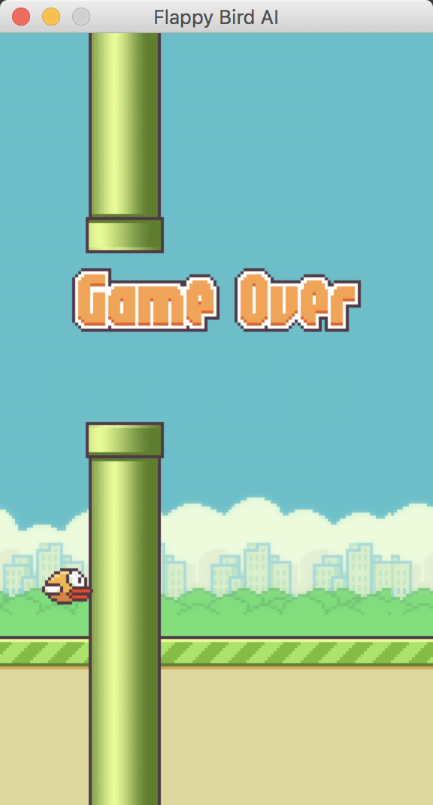

# Flappy AI: DQN based method for the famous Flappy Bird game

| | | | |
|:-------------------------:|:-------------------------:|:-------------------------:|:-------------------------:|
|||||

Based on the [Pygame](https://www.pygame.org/) library, Flappy AI is a clone of the famous mobile game Flappy Bird. A [DQN](https://www.cs.toronto.edu/~vmnih/docs/dqn.pdf) implementation is used for learning a policy from the 512 * 288 frames. The agent is trained using a reward of 1 if the bird passes a pipe, -1 if it collides and 0 otherwise.

Credits
-------

All the images (tubes, icons, etc) are from the sourahbhv's [repo](https://github.com/sourabhv/FlapPyBird/tree/master/assets/sprites). All the code is original.
